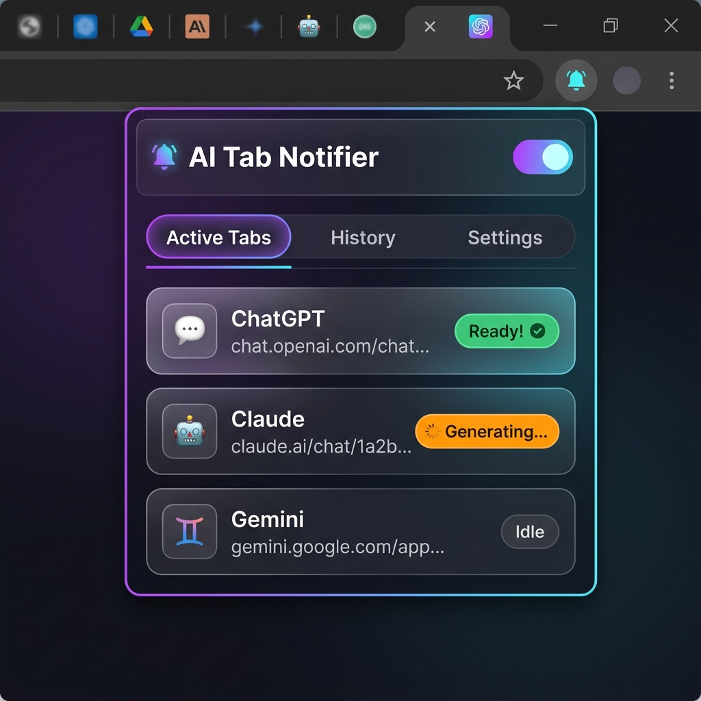
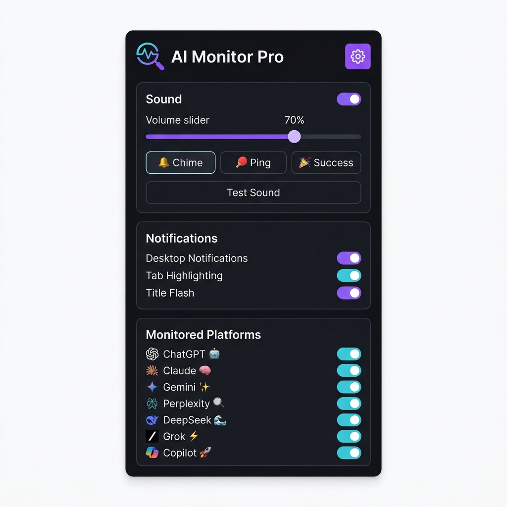

<](https://github.com/A2rjav/ai-tab-notifier)
[](https://developer.chrome.com/docs/extensions/mv3/)
[](LICENSE)
[](CONTRIBUTING.md)

<br />

</div>

---

## 💡 Why?

You're working with 5 AI tabs open — ChatGPT is thinking, Claude is writing, Gemini is analyzing. You switch to your code editor. **30 seconds later, you've forgotten which tab finished.** You start tab-hopping, wasting focus.

**AI Tab Notifier** fixes this. It watches every AI tab in the background and hits you with a sound + notification the _instant_ a response lands. Zero tab-checking. Pure flow state.

---

## 📸 Preview

<div align="center">
<table>
<tr>
<td align="center" width="50%">

<br />
<sub><b>Active Tabs</b> — Live status of all monitored AI tabs</sub>
</td>
<td align="center" width="50%">

<br />
<sub><b>Settings</b> — Full control over sounds, notifications & platforms</sub>
</td>
</tr>
</table>
</div>

---

## ⚡ Features

<table>
<tr>
<td width="60">🔊</td>
<td><b>Sound Alerts</b></td>
<td>3 built-in sounds (Chime, Ping, Success) with volume control. Web Audio API fallback ensures it always works.</td>
</tr>
<tr>
<td>💬</td>
<td><b>Desktop Notifications</b></td>
<td>Native OS notifications — click to jump straight to the ready tab.</td>
</tr>
<tr>
<td>⚡</td>
<td><b>Title Flash</b></td>
<td>Tab title flashes <code>⚡ Response Ready!</code> so you can spot it instantly in your tab bar.</td>
</tr>
<tr>
<td>🏷️</td>
<td><b>Smart Badges</b></td>
<td>Green <code>✓</code> = ready, Orange <code>...</code> = generating. Visible on the extension icon at a glance.</td>
</tr>
<tr>
<td>⌨️</td>
<td><b>Keyboard Shortcut</b></td>
<td><kbd>Ctrl</kbd>+<kbd>Shift</kbd>+<kbd>A</kbd> — instantly cycle through tabs with ready responses.</td>
</tr>
<tr>
<td>🎛️</td>
<td><b>Per-Platform Control</b></td>
<td>Toggle monitoring for each AI tool individually. Disable what you don't use.</td>
</tr>
<tr>
<td>⏱️</td>
<td><b>Auto-Dismiss</b></td>
<td>Notifications auto-clear after 5s, 10s, 30s — or never. Your choice.</td>
</tr>
<tr>
<td>📋</td>
<td><b>History Log</b></td>
<td>See a timeline of all past notifications. Click any to jump to that tab.</td>
</tr>
</table>

---

## 🤖 Supported Platforms

| Platform | Status | URLs |
|:---|:---:|:---|
| 🤖 **ChatGPT** | ✅ | `chatgpt.com` · `chat.openai.com` |
| 🧠 **Claude** | ✅ | `claude.ai` |
| ✨ **Gemini** | ✅ | `gemini.google.com` |
| 🔍 **Perplexity** | ✅ | `perplexity.ai` |
| 🌊 **DeepSeek** | ✅ | `chat.deepseek.com` |
| ⚡ **Grok** | ✅ | `grok.com` · `x.com/i/grok` |
| 🚀 **Copilot** | ✅ | `copilot.microsoft.com` |

> **Want more?** Adding a new platform is ~20 lines of config. See [Contributing](#-contributing).

---

## 📦 Install

### Option 1: Load from source (recommended)

```bash
# 1. Clone
git clone https://github.com/A2rjav/ai-tab-notifier.git

# 2. Open Chrome → chrome://extensions → Enable "Developer mode"

# 3. Click "Load unpacked" → select the ai-tab-notifier folder

# 4. Pin the extension from the puzzle piece icon. Done! 🎉
```

### Option 2: Download ZIP

1. Click the green **Code** button above → **Download ZIP**
2. Extract the folder
3. Load it as unpacked in `chrome://extensions`

---

## 🏗️ How It Works

```
┌─────────────────────────────────────────────────────────┐
│                    CHROME BROWSER                       │
│                                                         │
│  ┌──────────┐  ┌──────────┐  ┌──────────┐              │
│  │ ChatGPT  │  │  Claude  │  │  Gemini  │  ...more     │
│  │   Tab    │  │   Tab    │  │   Tab    │              │
│  └────┬─────┘  └────┬─────┘  └────┬─────┘              │
│       │              │              │                    │
│       ▼              ▼              ▼                    │
│  ┌──────────────────────────────────────┐               │
│  │         content.js (per tab)         │               │
│  │  MutationObserver watches DOM for:   │               │
│  │  • Stop buttons (generating)         │               │
│  │  • Send buttons (idle/ready)         │               │
│  │  • Loading indicators                │               │
│  └──────────────────┬───────────────────┘               │
│                     │ chrome.runtime.sendMessage         │
│                     ▼                                    │
│  ┌──────────────────────────────────────┐               │
│  │     background.js (service worker)   │               │
│  │  • Manages tab states                │               │
│  │  • Triggers notifications            │               │
│  │  • Updates badges                    │               │
│  │  • Coordinates everything            │               │
│  └───────┬──────────┬───────────────────┘               │
│          │          │                                    │
│          ▼          ▼                                    │
│  ┌────────────┐  ┌─────────────────┐                    │
│  │ offscreen  │  │  OS Notification │                   │
│  │  .html/.js │  │  (chrome.notif)  │                   │
│  │ 🔊 Audio  │  │  💬 Desktop     │                    │
│  └────────────┘  └─────────────────┘                    │
└─────────────────────────────────────────────────────────┘
```

### File Structure

```
ai-tab-notifier/
├── manifest.json          # Extension config (Manifest V3)
├── background.js          # Service worker — orchestrates state, badges, notifications
├── content.js             # Injected per AI tab — MutationObserver + polling
├── popup.html / js / css  # Extension popup — tabs, history, settings UI
├── offscreen.html / js    # Audio bridge (service workers can't play audio)
├── icons/                 # Extension icons (16px, 48px, 128px)
├── sounds/                # Notification sounds (gentle-chime, ping, success)
└── assets/                # README images
```

### Detection Strategy

The content script uses a **dual approach** for maximum reliability:

1. **`MutationObserver`** — Reacts to DOM changes in real-time (class changes, new elements, attribute mutations)
2. **Polling fallback** — Checks every 1.5s to catch edge cases the observer might miss

For each platform, we look for **generating indicators** (stop buttons, loading spinners, `animate-pulse` classes) and **idle indicators** (send buttons, enabled textareas). The state machine: `idle → generating → ready → idle`.

---

## ⚙️ Configuration

Everything is configurable from the popup:

| Setting | Options | Default |
|:---|:---|:---|
| Sound | On/Off + Volume slider | ✅ On, 70% |
| Sound Style | 🔔 Chime · 🏓 Ping · 🎉 Success | 🔔 Chime |
| Desktop Notifications | On/Off | ✅ On |
| Tab Highlighting | On/Off | ✅ On |
| Title Flash ⚡ | On/Off | ✅ On |
| Auto-Dismiss | 5s · 10s · 30s · Never | 10s |
| Platform Toggles | Per-platform on/off | All ✅ |

---

## 🤝 Contributing

Contributions are welcome! See [CONTRIBUTING.md](CONTRIBUTING.md) for the full guide.

```bash
# Fork → Clone → Branch → Code → PR
git checkout -b feature/awesome-thing
git commit -m "Add: awesome thing"
git push origin feature/awesome-thing
```

### 💡 Contribution Ideas

- 🆕 **New platforms** — Mistral, Meta AI, Phind, You.com
- 🎵 **Custom sounds** — Let users upload their own notification sounds
- 🌐 **i18n** — Translate the UI to other languages
- 🦊 **Firefox port** — Adapt for Firefox extensions API
- 📊 **Analytics** — Track how many responses you get per day
- 🎨 **Themes** — Light mode, custom accent colors

---

## 📄 License

MIT — do whatever you want with it. See [LICENSE](LICENSE).

---

<div align="center">

**Built with ❤️ for AI power users who refuse to waste time tab-checking.**

⭐ **Star this repo** if it saves you even one tab-switch.

</div>
]]>
